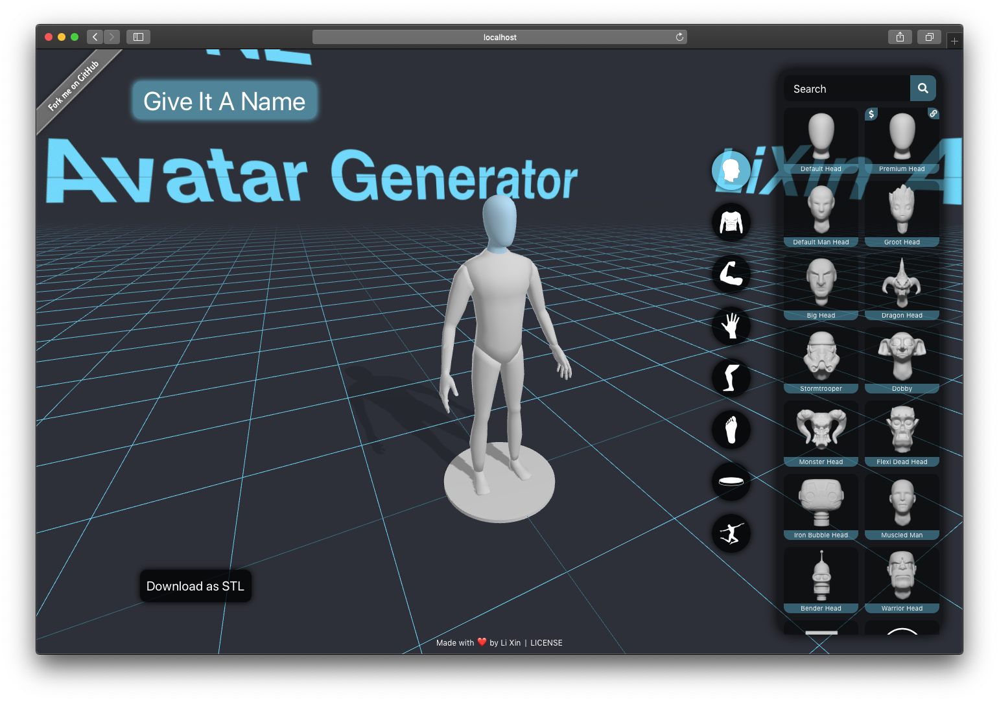
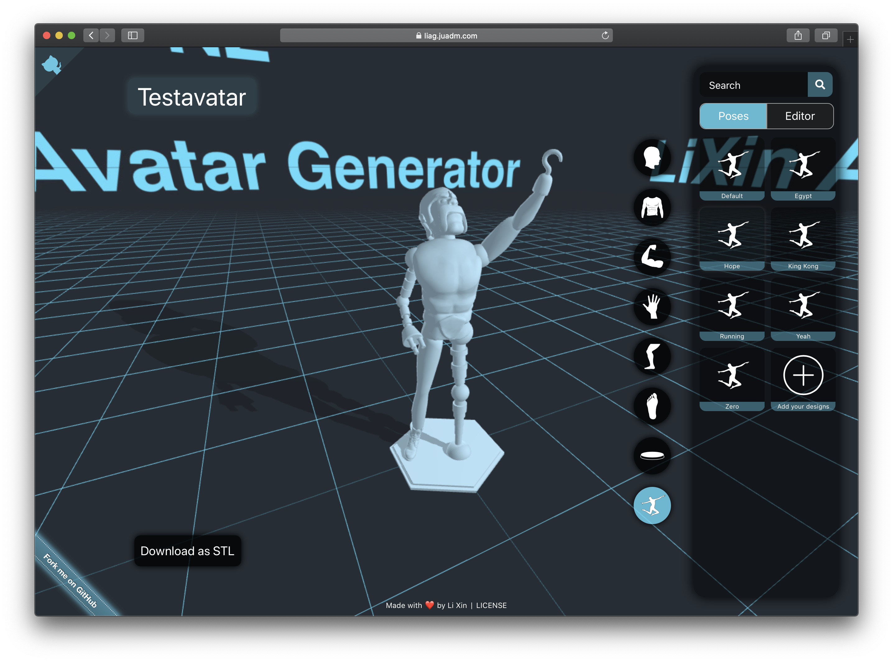
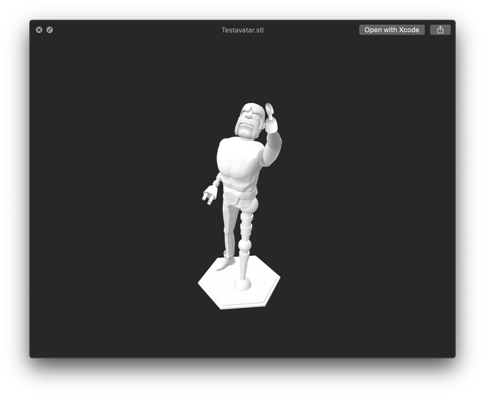

# LiAg

LiAg (Li Xin (Justin Lee) Avatar Generator) is an open source 3D avatar modelling software implemented in React.js and
WebGL,
which provides web side 3D avatar modeling and rendering service,
and users can export the avatars into STL files which can be used for 3D printing.

## Requirements

> - node.js `v22.8.0`
> - react.js `18.3.1`
> - three.js `0.169.0`

## Version

- `1.2.1`

## Platform Compatibility

- [ ] iOS (No plan to support)
- [x] iPadOS
- [x] macOS
- [x] Android (Only tablets)
- [x] Linux
- [x] Windows 11

## Installation Guide

Run the following code in the terminal to install and run the project.

```
git clone https://github.com/realJustinLee/LiAg.git
cd LiAg
npm run rebuild
npm install -g serve
serve -s build
```

## Screen Shots

The Component Selector


The Pose Editor


The Exported STL Model


## TODO

- [ ] Release this project to a desktop app with electron.

# Made with ❤ by [Justin Lee](https://github.com/realJustinLee)!

™ and © 1997-2022 Justin Lee. All Rights Reserved. [License Agreement](./LICENSE)
